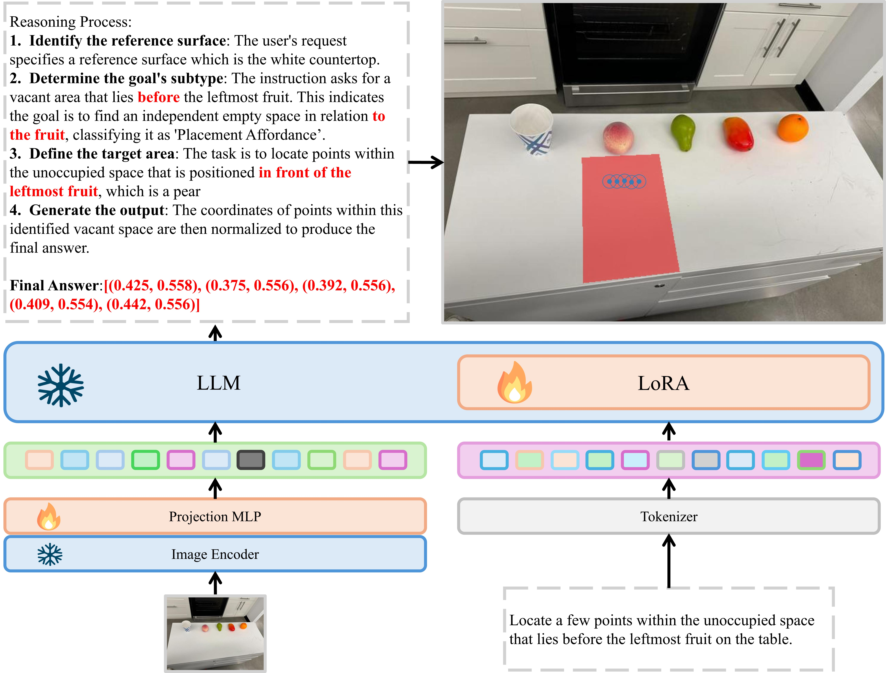

<div align="center">

# TRACE: Textual Reasoning for Affordance Coordinate Extraction

*A Vision-Language Model that enhances spatial affordance prediction through explicit textual Chain of Reasoning (CoR)*


<!-- For anonymous review - links temporarily removed -->
<!-- [](https://robo-point.github.io) [](https://4a1d27fb146d7216fa.gradio.live) [](#data-samples) [](#model-zoo) -->

**🧠 Chain of Reasoning • 🎯 Spatial Precision • 🤖 Vision-Language Model • 👁️ Attention Visualization**

</div>

---

## 🔍 Overview of TRACE's Reasoning Process

<div align="center">



*🔄 TRACE's multi-step reasoning pipeline: Given an image and natural language instruction, the system determines the goal subtype, establishes relevant reference surfaces, defines target areas through explicit reasoning, and generates precise normalized coordinates.*

</div>

---

## 📖 Introduction

**TRACE** (Textual Reasoning for Affordance Coordinate Extraction) is an enhanced Vision-Language Model that predicts image keypoint affordances by integrating an explicit textual **Chain of Reasoning (CoR)** into the spatial affordance prediction process. Building upon the RoboPoint framework, TRACE teaches models not only to predict precise spatial coordinates but also to articulate the reasoning behind their predictions.

### ✨ Key Innovations

<table>
<tr>
<td width="50%">

#### 🧠 **Textual Chain of Reasoning**
Unlike visual CoT methods that generate intermediate images, TRACE uses lightweight textual reasoning that leverages the VLM's native linguistic capabilities

#### 📊 **Enhanced Dataset** 
200,000 training samples with programmatically generated explicit reasoning steps

</td>
<td width="50%">

#### 🎯 **Improved Performance**
Achieves **48.1% accuracy** on the challenging Where2Place benchmark, a **9.6% relative improvement** over the original RoboPoint model

#### 🔍 **Interpretable Predictions**
Provides clear rationales for why specific spatial locations are selected

</td>
</tr>
</table>

> 💡 **Key Insight:** The approach addresses the critical gap between high-level reasoning and precise, low-level spatial understanding required for physical manipulation. As shown in the figure above, our model follows a multi-step reasoning process that first determines the goal subtype, establishes relevant reference surfaces, defines target areas, and finally generates normalized coordinates.

---

## 📋 Contents
- [⚙️ Install](#install)
- [📦 Data Samples](#data-samples)
- [🗂️ Dataset Construction](#dataset-construction)
- [🏋️ Training Configuration](#training-configuration)
- [📈 Evaluation](#evaluation)
- [🎨 Visualization](#visualization)
- [👁️ Attention Analysis](#attention-analysis)

<!-- Demo section temporarily removed for anonymous review -->
<!-- - [🚀 Demo](#demo) -->
<!-- - [🎯 Weights](#model-zoo) -->

---

## ⚙️ Install

```bash
./environment_setup.sh
```

or follow the instructions below in order.

```
conda create -n trace python=3.10 -y
conda activate trace

pip install --upgrade pip  # enable PEP 660 support

# this is optional if you prefer to system built-in nvcc.
conda install -c nvidia cuda=12.1 -y

pip install -e .

# this is optional if you don't need to train the model
pip install -e ".[train]"
pip install flash-attn --no-build-isolation
```

## 📦 Data Samples

<div align="center">

### 🎯 **50 Representative Samples Available for Review**

</div>

We provide **50 carefully selected samples** from our TRACE dataset for review purposes:

<table>
<tr>
<td width="50%" align="center">

#### 🎯 **25 Object Reference Samples**
Demonstrating spatial reasoning for object-relative positioning

</td>
<td width="50%" align="center">

#### 🌟 **25 Free Space Reference Samples**  
Showing vacant area identification with reasoning chains

</td>
</tr>
</table>

📁 **Location**: `data_samples/sample_50_cor_data.zip`

📋 **Contents**:
- ✅ Input images and natural language instructions
- 🧠 Complete Chain of Reasoning (CoR) explanations  
- 🎯 Ground-truth coordinate annotations
- 📊 Comparison with baseline methods

> 💡 These samples illustrate the key contribution of our work: **explicit textual reasoning** that justifies spatial coordinate predictions.

### 🚀 Full Dataset Availability

<div align="center">


</div>

The complete **TRACE reasoning dataset (200,000 samples)** will be made publicly available on **🤗 HuggingFace** upon paper acceptance:

- ✅ Complete training and evaluation splits
- 🧠 All Chain of Reasoning annotations
- 📖 Detailed dataset documentation and usage examples  
- 📊 Comparison baselines and evaluation metrics

<!-- Model weights and demo sections commented out for anonymous review -->
<!--
## Model Zoo
Version | LLM | Projector | Size | Schedule 
--------|-----|-----------|------|---------
spar-v1-vicuna-v1.5-13b | Vicuna-v1.5 | MLP2x | 13B | LoRA 1 epoch
spar-v1-vicuna-v1.5-13b-lora | Vicuna-v1.5 | MLP2x | 13B | LoRA 1 epoch
spar-v1-vicuna-v1.5-7b-lora | Vicuna-v1.5 | MLP2x | 7B | LoRA 1 epoch

*Note: Model weights will be made available upon publication.*

## Demo
[Demo section temporarily removed for anonymous review]
-->

## TRACE Dataset and Training

### Dataset Construction

The **TRACE dataset** consists of **200,000 training samples** created by enhancing the RoboPoint data generation pipeline. The dataset is composed of two data sources:
- **100,000 novel reasoning-augmented samples** with explicit textual Chain of Reasoning (CoR)
- **100,000 standard visual instruction-tuning samples** from LVIS and VQA datasets

The key innovation is the programmatic generation of explicit textual reasoning steps using the Gemini API, which breaks down the spatial reasoning process into interpretable steps.

*Note: The complete dataset will be released on HuggingFace upon paper acceptance. See [Data Samples](#data-samples) section for current availability.*

Each data sample includes:
- Input image and natural language instruction
- Multi-step textual reasoning process
- Final normalized 2D coordinates: `{(x_i, y_i) | x_i, y_i ∈ [0, 1]}`

Example reasoning structure:
1. **Goal Subtype Identification**: Determine if the task involves placement affordance, reference object identification, etc.
2. **Reference Surface Establishment**: Identify the relevant surface or area in the image
3. **Target Area Definition**: Define the specific region based on the instruction
4. **Coordinate Generation**: Output precise normalized coordinates

### Training Configuration

**Model Architecture:**
- **Base LLM**: Vicuna-v1.5-13B
- **Vision Encoder**: CLIP-ViT-Large-Patch14-336 (penultimate layer features)
- **Projector**: 2-layer MLP with GELU activation
- **Optimization**: Flash Attention 2 for memory efficiency

**Training Setup:**

**For 13B Model (Main Results):**
- **Optimization Method**: Full fine-tuning (FFT) for maximum performance
- **Optimizer**: AdamW with learning rate 2×10⁻⁶
- **Scheduler**: Cosine annealing with 3% warmup
- **Duration**: 1 epoch on TRACE dataset

**For 7B Model (Ablations & Analysis):**
- **Optimization Method**: Low-Rank Adaptation (LoRA) with rank r=128, α=256
- **Optimizer**: AdamW with learning rate 2×10⁻⁶
- **Scheduler**: Cosine annealing with 3% warmup
- **Precision**: bfloat16 mixed-precision with gradient checkpointing
- **Duration**: 1 epoch on TRACE dataset

**Data Processing Optimizations:**
- Lazy preprocessing for memory efficiency
- Square aspect ratio padding for uniform input
- Grouping by modality length to minimize padding
- 12 dataloader workers to prevent bottlenecks

## 📈 Evaluation

### 🏆 Benchmarks and Results

<div align="center">


</div>

We evaluate TRACE on challenging spatial affordance prediction benchmarks:

<div align="center">

| **Model** | **RoboRefIt** | **Where2Place (W2P)** | **W2P (hard)** |
|-----------|:-------------:|:---------------------:|:--------------:|
| **🎯 TRACE (Ours)** | **🏆 42.9% ± 0.8** | **🏆 48.1% ± 0.1** | **🏆 55.0% ± 3.5** |
| RoboPoint (Baseline) | 41.7% ± 0.6 | 43.9% ± 0.6 | 46.9% ± 4.2 |
| SpaceLLaVA | 20.0% ± 0.5 | 15.0% ± 1.6 | 13.6% ± 2.1 |
| GPT-4o | 6.5% ± 0.8 | 18.7% ± 2.6 | 17.8% ± 4.8 |

</div>

### 🎯 **Key Results:**

<table>
<tr>
<td width="50%">

#### 📊 **Quantitative Improvements**
- **9.6% relative improvement** over RoboPoint baseline on Where2Place
- **Statistically significant** improvement on W2P benchmark (p=0.022 < 0.05)
- **34.2% relative gain** on challenging W2P (hard) subset over baseline

</td>
<td width="50%">

#### 🌟 **Qualitative Strengths**  
- Consistent improvements across all benchmark categories
- Particularly strong performance on challenging unseen relation types (W2P hard)
- Dose-dependent relationship between CoR data quantity and performance

</td>
</tr>
</table>

### 🧪 Running Evaluations

To evaluate on Where2Place:

```bash
# Generate results
python robopoint/eval/model_vqa.py \
    --model-path trace-v1-vicuna-v1.5-13b \
    --image-folder datasets/where2place/images \
    --question-file datasets/where2place/point_questions.jsonl \
    --answer-file output/trace-v1-vicuna-v1.5-13b.jsonl

# Compute accuracy
python robopoint/eval/summarize_vqa.py --answer output/trace-v1-vicuna-v1.5-13b.jsonl
```

### 🎨 Visualization

TRACE includes comprehensive visualization tools to analyze model predictions and Chain of Reasoning outputs:

```bash
# Visualize model comparisons with reasoning analysis
python visualization/visualize_results.py \
    --answer-files output/robopoint-baseline.jsonl output/trace-v1-vicuna-v1.5-13b.jsonl \
    --labels robopoint trace \
    --data-dir datasets/where2place/images \
    --output output/visualization_results \
    --num 10
```

**Parameter Explanation:**
- `--answer-files`: Model output files from `model_vqa.py`
  - **TRACE answer file**: Contains reasoning chains + coordinates
  - **Baseline file**: Contains coordinates only
- `--labels`: Labels for each model in the visualization plots
- `--data-dir`: Benchmark dataset location (images + ground-truth masks)
- `--output`: Directory where visualization results will be saved
- `--num`: Number of samples to visualize

**Visualization Features:**
- 🎯 **Coordinate Prediction Overlay**: Visual comparison of predicted vs ground-truth points
- 🧠 **Chain of Reasoning Display**: Step-by-step reasoning process visualization  
- 📊 **Model Comparison**: Side-by-side comparison of different model outputs
- 🔍 **Error Analysis**: Detailed analysis of prediction accuracy and failure cases

## 👁️ Attention Analysis

TRACE provides unique insights into the model's reasoning process through comprehensive attention visualization and batch processing capabilities:

```bash
# Batch process Where2Place dataset with reasoning milestone attention
python visualization/attention_map.py \
    --model-path trace-v1-vicuna-v1.5-7b \
    --model-base path/to/base/model \
    --dataset-dir datasets/where2place \
    --output-dir output/attention_analysis \
    --start-idx 0 --end-idx 100
```

**Attention Analysis Features:**
- 🔍 **Multi-step Attention Tracking**: Visualize how attention changes during each reasoning milestone:
  1. **Identify Reference Object** - Initial context establishment
  2. **Define Target Area** - Spatial area definition  
  3. **Determine Goal Subtype** - Task classification (critical reasoning step)
  4. **Generate Output** - Coordinate generation
  5. **Final Answer** - Complete response with overlays
- 📊 **Comprehensive Visualizations**:
  - Individual milestone images with transparent attention overlays
  - Combined milestone progression visualization
  - Ground truth mask overlays (cyan)
  - Predicted coordinate points (red dots)
- 📈 **Batch Processing**: Process entire datasets with statistical analysis
- 🎯 **Interactive Dashboard**: Summary statistics and success rates
- 💾 **Detailed Output**: Individual files for each reasoning step with descriptive names

**Key Parameters:**
- `--model-path`: Path to TRACE model
- `--model-base`: Base model path
- `--dataset-dir`: Dataset directory (expects `images/` and `masks/` subdirectories)
- `--output-dir`: Output directory for all visualizations and analysis
- `--start-idx/--end-idx`: Process specific range of images
- `--resume`: Resume from existing results

> 💡 **Key Finding**: The attention analysis reveals that TRACE exhibits **diffuse attention** during initial steps (reference identification, target definition) but **concentrated attention** during goal subtype determination. During final coordinate generation, there is **minimal visual attention**, indicating the model relies primarily on its completed textual reasoning chain rather than continuous visual grounding, demonstrating the effectiveness of the Chain of Reasoning approach.

## 📄 Citation

<div align="center">


</div>

**Note:** This work originally builds upon the foundation of RoboPoint (Yuan et al., 2024) but represents a significant extension with Chain of Reasoning capabilities. 

> **🔄 CITATION INFORMATION FOR TRACE WILL BE UPDATED UPON PUBLICATION**

**📚 Reference to Original Foundation:**
```bibtex
@article{yuan2024robopoint,
  title={RoboPoint: A Vision-Language Model for Spatial Affordance Prediction for Robotics},
  author={Yuan, Wentao and Duan, Jiafei and Blukis, Valts and Pumacay, Wilbert and Krishna, Ranjay and Murali, Adithyavairavan and Mousavian, Arsalan and Fox, Dieter},
  journal={arXiv preprint arXiv:2406.10721},
  year={2024}
}
```

## Acknowledgements

This work was initially inspired by RoboPoint (Yuan et al., 2024). We thank the original authors for their open-source contribution.

- **RoboPoint**: Initial foundation that inspired our Chain of Reasoning approach
- **LLaVA**: Visual instruction tuning pipeline and multimodal architecture

## Limitations and Future Work

While TRACE demonstrates significant improvements in spatial affordance prediction, some limitations remain:

- **Synthetic Reasoning**: The reasoning chains are programmatically generated and may not capture the full complexity of human spatial reasoning
- **No Confidence Estimates**: Like RoboPoint, TRACE doesn't provide confidence scores for predicted points
- **Fixed Output Structure**: The number of output points is not controllable
- **Attention Control**: While attention analysis provides insights, the model lacks explicit mechanisms to control the attention process

**Future Directions:**
- Extending CoR to multi-step manipulation and navigation tasks
- Incorporating human-generated reasoning examples
- Adding confidence estimation and controllable output generation
- Exploring more sophisticated reasoning structures for complex spatial relationships
